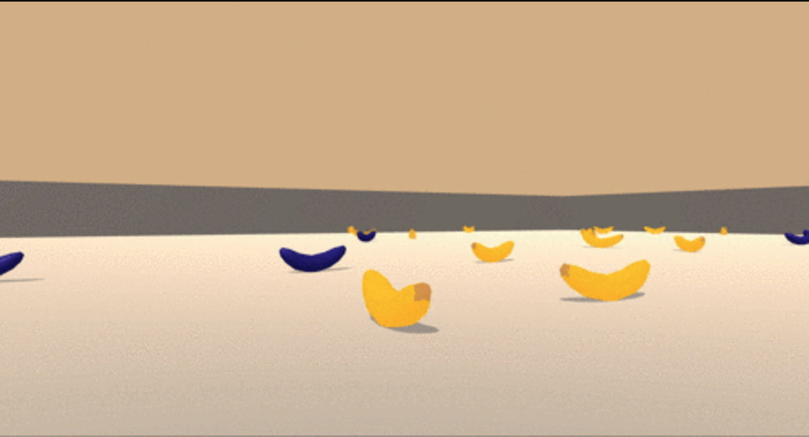

# DQN Pytorch

This project is a Pytorch implementation of several variants of the Deep Q Learning (DQN) model. It is based on the material provided by Udacity's Deep Reinforcement Learning Nanodegree. The objective is to use one of the Unity ML-Agents libraries to demonstrate how different DQN implementations can be coded, trained and evaluation. 



# Sumary

The code structure builds from the Nature DQN, and incrementally implements 3 modifications, in order: Double Q Learning, Duelling Networks and Prioritized Experience Replay. The articles for each one of these implementations can be found at

- DQN [[1]](#references)
- Double DQN [[2]](#references)
- Dueling Network Architecture [[3]](#references)
- Prioritised Experience Replay [[4]](#references)

Although the code can be used in any operating system, the compiled versions of the Unity ML-Agents environment used are only available to MAC (with graphics) and Linux (headless version, for faster training). To download the Linux version with graphics or the Windows versions, please use the links below (provided by Udacitys Nanodeegre):

* Linux: click [here](https://s3-us-west-1.amazonaws.com/udacity-drlnd/P1/Banana/Banana_Linux.zip)
* Windows (32-bit): click [here](https://s3-us-west-1.amazonaws.com/udacity-drlnd/P1/Banana/Banana_Windows_x86.zip)
* Windows (64-bit): click [here](https://s3-us-west-1.amazonaws.com/udacity-drlnd/P1/Banana/Banana_Windows_x86_64.zip)


# Dependencies

1. It is recommended to use mini-conda to manage python environments. In order to install the dependencies the initial step would be:

```bash
	conda create --name dqn-pytorch python=3.6
	source activate dqn-pytorch
```

2. The necessary packages to run the code can be obtained by cloning and installing Udacity's Nanodegrees repository (plus, the repo is lots of fun to anyone wanting to explore more projects related to reinforcement learning)
```bash
git clone https://github.com/udacity/deep-reinforcement-learning.git
cd deep-reinforcement-learning/python
pip install .
```

3. To use jupyter notebooks or jupyter lab properly, it is important to create an ipython kernel.
```bash
python -m ipykernel install --user --name dqn-pytorch --display-name "dqn-pytorch"
```

4. Before running code in a notebook, change the kernel to match the `dqn-pytorch` environment by using the drop-down `Kernel` menu. 

# Unity ML-Agents Environment

The environment consists of a robot surround by a boxed enclosure filled with yellow and blue bananas At each time step, it has four actions at its disposal:
- `0` - walk forward 
- `1` - walk backward
- `2` - turn left
- `3` - turn right

The state-space has `37` dimensions and contains the agent's velocity, along with ray-based perception of objects around agent's forward direction.  A reward of `+1` is provided for collecting a yellow banana, and a reward of `-1` is provided for collecting a blue banana. 

# Training and Playing

To get started with the code, the first step is to load the Unity-ML agents environment. It is important to note

```python
from unityagents import UnityEnvironment

env = UnityEnvironment(file_name="Environments/Banana.app")
brain_name = env.brain_names[0]
brain = env.brains[brain_name]
```


```python
from dqn import PriorAgent, PTraining

agent = PriorAgent(state_size=37, action_size=4, seed=0)
training_setup = PTraining(n_episodes=2000, eps_start=1, eps_end=0.01, eps_decay=0.995, beta_start=0.4, beta_inc=1.002)
scores = training_setup.train(agent, env, brain_name, track_every=2, plot=True, weights='final.pth',success_thresh=20.)
```

# Code base

The folder system in the code is structured as:

* benchmarks - Training scores and description of each model already trained

* dqn - Main library, with different implementations of the DQN model

* models - Saved weights of the trained models

* images - Saved images of results

# DQN library

The DQN libray is organized in classes as follows

* Model Modules - Modules to train and use each one of the implementations
* Benchmarks - Class to load and display the saved training scores

Each model module is organized as

* Agent - The agent implementation, responsible to interact and learn with the environment 

* Model - Neural Net implementation in PyTorchh of the DQN architecture

* Training - Convenience  class to handle training and tracking of the agent 

For a description of the implementation of the most complex variant, see the Report document.

The available models and corresponding classes are:

* Nature DQN \
    The original DQN proposed
    ```python
        from dqn.nature import DQNAgent, NatureTraining
    ```

* Double DQN \
    DQN with modification to implement double q learning
    ```python
        from dqn.double import DDQNAgent, DDQNAgent
    ```

* Duelling DQN \
    DQN with modification to implement double q learning and a dueling network architecture
    ```python
        from dqn.duelling import DDDQNAgent, DuelTraining
    ```

* Prioritized Replay \
    DQN with modification to implement double q learning, a dueling network architecture, and Prioritized replay
    ```python
        from dqn.prioritized import PriorAgent, PTraining
    ```

# Results

The 4 models implemented have trained versions saved in the models folder. Those models are named as:

* Nature DQN -> dqn.pth
* Double DQN -> ddqn.pth
* Duelling Double DQN -> dddqn.pth
* Prioritezed Replay DQN -> priordqn.pth
* Prioritezed Replay trained through 2000 steps -> final.pth

To load a model, it is necessary to instantiate the corresponding class and then load the weights. Below is an example to load the Prioritized Replay model trained through 2000 steps.

```python
from dqn import PriorAgent, PTraining, Benchmarks

agent = PriorAgent(state_size=37, action_size=4, seed=0)
agent.load_weights('final.pth')
```

For further details of implementation and the results of training, please refer to the Report file [here](./Report.md).

# References


 
[1] [Deep Reinforcement Learning with Double Q-learning](http://arxiv.org/abs/1509.06461)

[2] [Deep Reinforcement Learning with Double Q-learning](https://arxiv.org/abs/1509.06461)

[3] [Dueling Network Architectures for Deep Reinforcement Learning](http://arxiv.org/abs/1511.06581)

[4] [Prioritized Experience Replay](http://arxiv.org/abs/1511.05952)  
 
