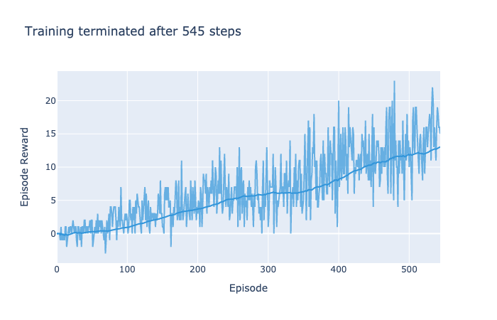
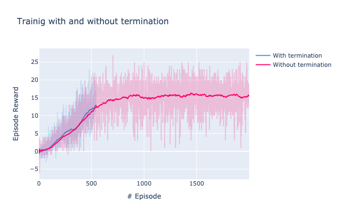

# DQN Implementation Report

This report describes the implementation present here of a DQN agent with Double Q Learning, Duelling Network Architecture and Prioritized Experience Replay.

# The Neural Network Model

The Neural Network Model is implemented in Pytorch, the code is simple and contains only two parts. First, the model is defined. The architecture used consisted of 2 hidden layers, one with 128 and the other with 256 neurons, followed by the two dueling regression heads. One to compute the state values and the other to compute the advantages

```python
    def __init__(self, state_size, action_size, seed):
        super(DuelQNetwork, self).__init__()
        self.seed = torch.manual_seed(seed)
        self.fp1 = nn.Linear(state_size, 128)
        self.fp2 = nn.Linear(128, 256)
        self.head_values = nn.Linear(256, 1)
        self.head_advantages = nn.Linear(256, action_size)
```

 The second part is simply the forward pass, where each regression head is computed, and both are combined by the method described in [paper]

```python
    def forward(self, state):
        x = F.relu(self.fp1(state))
        x = F.relu(self.fp2(x))
        values = self.head_values(x)
        advantages = self.head_advantages(x)
        return values + (advantages - advantages.mean()
```

# The Agent

The agent is implemented in a python class. It receives two instances of the Neural Network defined above, one to compute the target Q-values, and one to estimate the current beliefs. The agent also receives an implementation of the ReplayBuffer class to manage the experience buffer.

```python
    self.qnetwork_local = DuelQNetwork(state_size, action_size, seed).to(device)
    self.qnetwork_target = DuelQNetwork(state_size, action_size, seed).to(device)
    self.optimizer = optim.Adam(self.qnetwork_local.parameters(), lr=LR)
    # Replay memory
    self.memory = ReplayBuffer(action_size, BUFFER_SIZE, BATCH_SIZE, seed)
```

The agent interacts with the environment, acting in an epsilon greedy policy according to the act function 

```python
    state = torch.from_numpy(state).float().unsqueeze(0).to(device)
    self.qnetwork_local.eval()
    with torch.no_grad():
        action_values = self.qnetwork_local(state)
        self.qnetwork_local.train()
        # Epsilon-greedy action selection
        if random.random() > eps:
            return np.argmax(action_values.cpu().data.numpy())
        else:
            return random.choice(np.arange(self.action_size))
```

Every time the agent acts, it saves the experience in the replay buffer, to learn afterward after a fixed number of actions (the UPDATE_EVERY variable)

```python
  self.memory.add(state, action, reward, next_state, done)
        
        # Learn every UPDATE_EVERY time steps.
        self.t_step = (self.t_step + 1) % UPDATE_EVERY
        if self.t_step == 0:
            # If enough samples are available in memory, get random subset and learn
            if len(self.memory) > BATCH_SIZE:
                experiences = self.memory.sample()
                self.learn(experiences, GAMMA, beta)
```

The buffer class has two main structures, one to save the experiences and another to keep the priorities of the experience

```python
    self.experience = namedtuple("Experience", field_names=["state", "action", "reward", "next_state", "done"])
    self.priorities = np.zeros(buffer_size)
```

When the experiences are saved, the priorities array is also updated to match the experience buffer, and the new experiences are assigned the maximum priority present so far.

```python
    def add(self, state, action, reward, next_state, done):
        """Add a new experience to memory."""
        e = self.experience(state, action, reward, next_state, done)
        self.memory.append(e)
        if len(self.memory) == self.buffer_size:
            np.roll(self.priorities, -1)
            self.priorities[-1] = self.max_priority
        else:
            self.priorities[max(len(self.memory) - 1,0)] = self.max_priorit
```

At sample time, the priorities are converted to sample probabilities. Instead of sampling the experiences directly, the indices are sampled, so they can be remembered to update the sampled priorities afterward.

```python
        probabilities = self.probs(self.priorities)[:len(self.memory)]
        experiences_idx = np.random.choice(len(self.memory), size=self.batch_size, p=probabilities)
        experiences = [self.memory[idx] for idx in experiences_idx]
```

The training of the agent with the sample experiences can be divided in three steps. First, the targets are computed in a double q-learning setup.

```python
        current_qs = self.qnetwork_local(states).gather(1, actions)
        next_actions = self.qnetwork_local(next_states).detach().max(1)[1].unsqueeze(1)
        max_next_qs = self.qnetwork_target(next_states).detach().gather(1, next_actions)
        target_qs = rewards + GAMMA*max_next_qs
```

Then, the importance sampling weights to compensate the prioritized sampling are calculated and used to multiply the loss (and, consequently, the error gradients)

```python
    is_weights = np.power(probabilites*BATCH_SIZE, -beta)
    is_weights = torch.from_numpy(is_weights/np.max(is_weights)).float().to(device)
    loss = (target_qs - current_qs).pow(2) * is_weights
    loss = loss.mean()
```

Finally, the temporal difference errors are updated, and the model weights are updated. 

```python
    td_errors = (target_qs - current_qs).detach().numpy()
    self.memory.update_priorities(experiences_idx, td_errors)
        
    self.qnetwork_local.zero_grad()
    loss.backward()
    self.optimizer.step()
```

At every learning step, the target network is updated with the local network weight. But the update is made in a soft manner, moving the target_network weights only slightly in the local_network direction.

```python
    def soft_update(self, local_model, target_model, tau):
        """Soft update model parameters.
        θ_target = τ*θ_local + (1 - τ)*θ_target

        Params
        ======
            local_model (PyTorch model): weights will be copied from
            target_model (PyTorch model): weights will be copied to
            tau (float): interpolation parameter 
        """
        for target_param, local_param in zip(target_model.parameters(), local_model.parameters()):
            target_param.data.copy_(tau*local_param.data + (1.0-tau)*target_param.data
```

This ends the overview of the implementation of the code.

# Training

Training is implemented by the training class. The values used to the fixed hyperparameters are defined in the prior_agent file, and were:

```python
BUFFER_SIZE = int(1e5)  # replay buffer size
BATCH_SIZE = 64         # minibatch size
GAMMA = 0.99            # discount factor
TAU = 1e-3              # for soft update of target parameters
LR = 5e-4               # learning rate 
EPS = 1e-4              # constant used to stabilize the priorities in sampling
UPDATE_EVERY = 4        # how often to update the network
ALPHA = 0.6             # constant to smooth the samping distribution
```

Besides the fixed parameters, a strategy for the epsilon for the epsilon-greedy strategy and the beta for the importance sampling weights correction should be defined. Those two are determined by an initial value, a multiplying constant, and a final value (in the case of the beta parameter, the final value is implicitly set to 1). The update steps are defined as:

```python
    def __update_params(self):
        self.eps = max(self.eps_end, self.eps_decay*self.eps)
        self.beta = min(1.0, self.beta_inc*self.beta)
```

The values used for the trained models where:

* epsilon -> eps_start = 1, eps_decay = .995, eps_end = 0.01
* beta -> beta_start = 0.4, beta_inc = 1.002


# Performance

The algorithm was trained in two setups. First, it trained until an average score > 13.0 had been obtained for the last 100 episodes. 



Afterward, the same model was allowed to run for 2000 steps without interruption.




The training during 2000 steps revealed that the model could further improve on the results achieved previously, elevating the average score to 15.7. After some more steps, though, the model could not improve on the results already achieved

# Future Work Ideas

Besides the improvements implemented here, there are a number of other modifications that can be made to achieve state-of-the-art performance. A next step would be to implement distributional Q-learning, noisy exploration networks, and multiple steps updates. Those modifications would lead the Agent to be a Rainbow model of DQN. Moving even further, one could change the distribution implementation of the Rainbow architecture to a more efficient technique, such as quantile regression.


